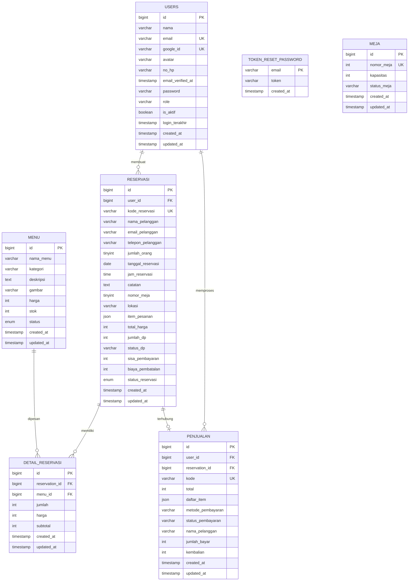

# ERD - Sistem POS

```mermaid
erDiagram
    USERS {
        bigint id PK
        varchar nama
        varchar email UK
        varchar google_id UK
        varchar avatar
        varchar no_hp
        timestamp email_verified_at
        varchar password
        varchar role
        boolean is_aktif
        timestamp login_terakhir
        timestamp created_at
        timestamp updated_at
    }

    TOKEN_RESET_PASSWORD {
        varchar email PK
        varchar token
        timestamp created_at
    }

    MENU {
        bigint id PK
        varchar nama_menu
        varchar kategori
        text deskripsi
        varchar gambar
        int harga
        int stok
        enum status
        timestamp created_at
        timestamp updated_at
    }

    MEJA {
        bigint id PK
        int nomor_meja UK
        int kapasitas
        varchar status_meja
        timestamp created_at
        timestamp updated_at
    }

    RESERVASI {
        bigint id PK
        bigint user_id FK
        varchar kode_reservasi UK
        varchar nama_pelanggan
        varchar email_pelanggan
        varchar telepon_pelanggan
        tinyint jumlah_orang
        date tanggal_reservasi
        time jam_reservasi
        text catatan
        tinyint nomor_meja
        varchar lokasi
        json item_pesanan
        int total_harga
        int jumlah_dp
        varchar status_dp
        int sisa_pembayaran
        int biaya_pembatalan
        enum status_reservasi
        timestamp created_at
        timestamp updated_at
    }

    DETAIL_RESERVASI {
        bigint id PK
        bigint reservation_id FK
        bigint menu_id FK
        int jumlah
        int harga
        int subtotal
        timestamp created_at
        timestamp updated_at
    }

    PENJUALAN {
        bigint id PK
        bigint user_id FK
        bigint reservation_id FK
        varchar kode UK
        int total
        json daftar_item
        varchar metode_pembayaran
        varchar status_pembayaran
        varchar nama_pelanggan
        int jumlah_bayar
        int kembalian
        timestamp created_at
        timestamp updated_at
    }

    USERS ||--o{ RESERVASI : "membuat"
    USERS ||--o{ PENJUALAN : "memproses"
    RESERVASI ||--o{ DETAIL_RESERVASI : "memiliki"
    RESERVASI ||--o| PENJUALAN : "terhubung"
    MENU ||--o{ DETAIL_RESERVASI : "dipesan"
```
